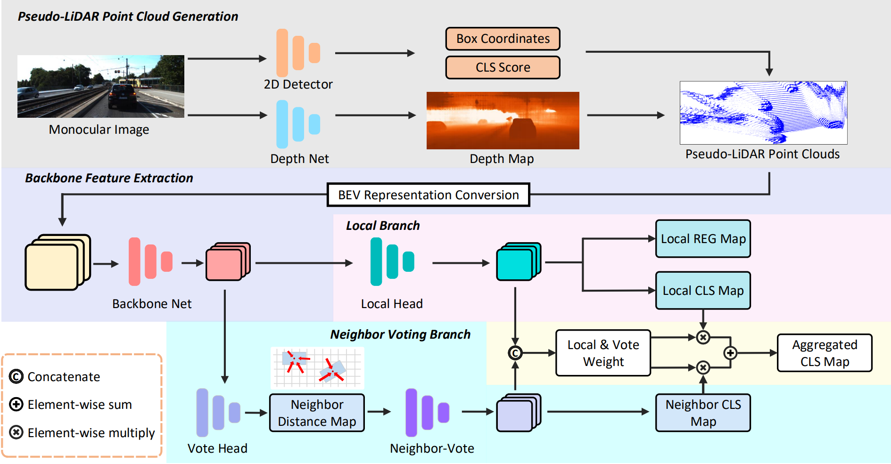

# Neighbor-Vote

<p align="center">  </p>

This is the official implementation of [**# Neighbor-Vote: Improving Monocular 3D Object Detection through Neighbor Distance Voting**](https://arxiv.org/abs/2107.02493), built on [`OpenPCDet`](https://github.com/open-mmlab/OpenPCDet).

```
@article{chu2021neighbor,
title={Neighbor-Vote: Improving Monocular 3D Object Detection through Neighbor Distance Voting},
author={Chu, Xiaomeng and Deng, Jiajun and Li, Yao and Yuan, Zhenxun and Zhang, Yanyong and Ji, Jianmin and Zhang, Yu},
journal={arXiv preprint arXiv:2107.02493},
year={2021}
}
```

### Installation

1. Prepare for the running environment.
   
   You can follow the installation steps in [`OpenPCDet`](https://github.com/open-mmlab/OpenPCDet).
2. Prepare for the data.
   
   Please download the official [KITTI 3D object detection](http://www.cvlibs.net/datasets/kitti/eval_object.php?obj_benchmark=3d) dataset and you need to prepare your depth maps and put them to `data/kitti/training/dorn`. To provide ease of use, [PatchNet](https://github.com/xinzhuma/patchnet) provides the estimated [depth maps](https://drive.google.com/file/d/1VLG8DbjBnyLjo2OHmrb3-usiBLDcH7JF/view) generated from the pretrained models [DORN](https://github.com/hufu6371/DORN). And you can directly download the results of 2D detector FCOS on the KITTI train set from [here](https://drive.google.com/file/d/1_h9yDtHa99hh-vZjCx57u9W4Z4LOCnDv/view?usp=sharing). Please organize the downloaded files as follows:
   
   ```
   Neighbor-Vote
   ├── data
   │   ├── kitti
   │   │   │── ImageSets
   │   │   │── training
   │   │   │   ├──calib & velodyne & label_2 & image_2 & dorn & 2d_score_fcos
   ├── pcdet
   ├── tools
   ```
   
   Generate the data infos by running the following command:
   
   ```
   python -m pcdet.datasets.kitti.kitti_dataset create_kitti_infos tools/cfgs/dataset_configs/kitti_dataset.yaml
   ```
3. Setup.
   
   ```
   python setup.py develop
   ```

### Pretrained Models

The pretrained model can be downloaded from [here](https://drive.google.com/file/d/1HszwZaMgBiJStEuw0IBUumgcDe4HOzEW/view?usp=sharing)

### Getting Started

Test the model.

The configuration file is in tools/cfgs/voxelrcnn, and the training scripts is in tools/scripts.

```
cd tools
sh scripts/dist_test.sh ${NUM_GPUS} \
--cfg_file ${CONFIG_FILE} --batch_size ${BATCH_SIZE} --ckpt ${CKPT}
```

### Acknowledge

Thanks to the strong and flexible [`OpenPCDet`](https://github.com/open-mmlab/OpenPCDet) codebase maintained by Shaoshuai Shi ([@sshaoshuai](http://github.com/sshaoshuai)) and Chaoxu Guo ([@Gus-Guo](https://github.com/Gus-Guo)).

### Contact

This repository is implemented by Xiaomeng Chu (cxmeng@mail.ustc.edu.cn).
